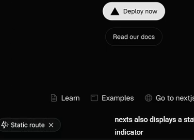

* Handling the /docs Base Route
  - We should use `[[...slug]]` instead of `[...slug]` if we want `/docs` to work. If we use `[...slug]`, opening `/docs` will result in **Not Found**.

* Next.js Docs Routing — Which to Use?
  - If the page UI is **static** → use `page.tsx`
  - If the page UI is **dynamic based on the URL** → use `[[...slug]]/page.tsx`


* **Name React components using PascalCase, and name their files using kebab-case.** ✅
  - product-card.tsx   // file (kebab-case)
  - ProductCard        // component (PascalCase)

* URL Underscore:
  - if you actially want an underscore in your URL, use "%5F
  instead. That's just the URL-encoded version of and underscore.s

* Layouts:
  - layout.tsx is required — deleting it will cause Next.js to recreate it automatically.

* How Metadata Works in Next.js

  1. Metadata is read from top to bottom (Root → Page)
  2. Metadata from different levels is merged together
  3. Page metadata overrides layout metadata when properties match

* Important Note About Metadata in Next.js
  - Metadata cannot be used in Client Components.

  - You must define metadata only in Server Components,
  - such as layout.tsx or page.tsx files without "use client".

* Important Note About Link Component
  - we can use a prop ["replace"] that replace the current url by the url cliked 

* Client Component and async:
  - we can't use aysnc with client component, if we wand to get params or searchParams without await we can use "use". Ex: use(params).

* Redirect Vs useRouter
  - Server  → redirect()
  - Client  → useRouter()

* Template File:
  - layout   → يحافظ على state بين الصفحات
  - template → يعيد ضبط state عند كل navigation

* Special Files:
  - page.tsx
  - layout.tsx
  - template.tsx
  - not-found.tsx
  - loading.tsx
  - error.tsx

* Error Handle:
  - To see the error in production write npm run build
  then npm run start.
  - ErrorBoundary must be client component.

* Component hierarchy:
```plainText
  <Layout>
      <Template>
        <ErrorBoundary fallback={<Error />}>
          <Suspense fallback={<Loading />}>
            <ErrorBoundary fallback={<NotFound />}>
              <Page />
            </ErrorBoundary>
        </Suspense>
      </ErrorBoundary>
    </Template>
  </Layout>
```

* Router Refresh  
  - **`router.refresh()` re-fetches the current route data without reloading the page.**

* Global Error
  - works only in production mode
  - requires html and body tags to be rendered

* Parallel Routes:
  - If one slot is dynamic, all slots at that level must be dynamic
  - Slot are not route segment and don't affect your url structure.
  - children prop is actually an implicit slot, that doesn't need its own folder, complex-dashboard/page.tsx is the same as complex dashboard/@children/page.tsx
  - Slots are combined with the regular Page component to form the final page

* Import Type:
  - Use import type when only referencing a name for type-checking (e.g., req: NextRequest), as it is erased during compilation.
  - Use a regular import when you need the runtime value, such as instantiating a class with new NextRequest().
    Would you like to see a one-line example of how to combine both?

* Default Content Type:
  - By default content type is text/plain

* Caching in Route Handlers
  - Route handlers are not cached by default but you can opt into caching when using the GET method
  - Since the data in the database rarely changes, every request in this endpoint will trigger a databse query wich is inefficient, to avoid this you use caching[simply we can use => export const dynamic = "force-static"], and that will ensure that the response is cached and saved instantly to all users  
  - we can't test the cahing in static data we need dynamic data...
  - we can't see the caching in development mode, we need to use the build mode.
  - if we want to revalidate our data we can use [export const revalidate = 10]
  - Caching only works with GET methods
  - Other HTTP methods like POST, PUT, or DELETE are never cached
  - if you're using dynamic functions like headers() and cookies(), or working with the request object in your GET method, caching won't be applied
  - Keys: 
    ```plaintText
    |__ export const dynamic = "force-static"
    |__ export const revalidate = 10 (10s)
    ```

- Rewrites:
  - rewrites: take you to the new URL but no changing in the url at the http://...

- Custome Header:
  - custom-header: custome headers are super useful for passing extra information wich can be used by client side scripts of for debugging.

## Routing section summary:
  ```
  - Route definition
  - Pages and layouts
  - Dynamic routes  
  - Route groups
  - Linking and navigation
  - Loading and error states
  - Parallel and intercepting routes
  - Route handlers and middleware
  ```

---

* React Server Component:
  - In the RSC architecture and by extension in the Next.js app router, components
  are server components by default
  - To create client components, add the "use client" directive at the top of the file
  - Server components are rendered exclusively on the server
  - Client components primarily operate on the client but can (and should ) also run once on the server for better performance
  - On development mode, there is strict mode because that we see the message is logged twice in the browser.

* Difference bteween route.ts and page.tsx in rebuild time

| Feature          | Page (page.tsx)                                             | Route (route.ts)                                     |
| ---------------- | ----------------------------------------------------------- | ---------------------------------------------------- |
| Default Behavior | Static (Pre-rendered at Build)                              | Dynamic (Executed at Request)                        |
| Goal             | Maximum Speed (UX)                                          | Data Accuracy                                        |
| Dynamic Trigger  | Calling `cookies()`, `headers()`, أو استخدام `searchParams` | Using POST/PUT/DELETE أو الوصول إلى `Request` object |
| Time Handling    | Shows the Build Time                                        | Shows the Request Time                               |

* Development Mode
  - in development mode we have an important indicator
  of static and dynamic route
  

* Production Mode
  - in product mode we need to delete the .next folder created at development mode to see the contents of folder...

* Static rendering summary

Static rendering is a strategy where the HTML is generated at build time

Along with the HTML, RSC payloads for components and JavaScript chunks for
client-side hydration are created

Direct route visits serve HTML files

Client-side navigation uses RSC payloads and JavaScript chunks without
additional server requests

Static rendering is great for performance, especially in blogs, documentation, and
marketing pages


