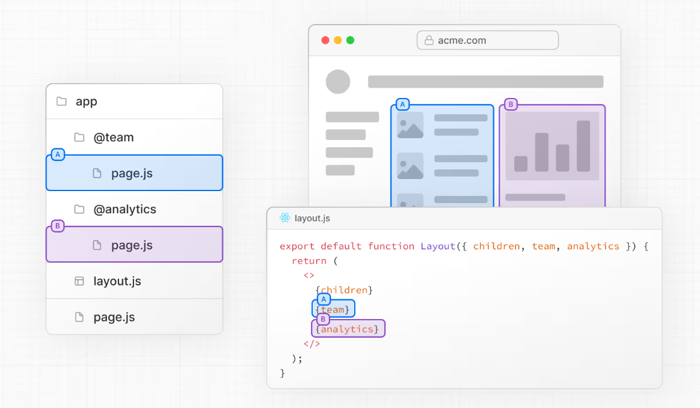
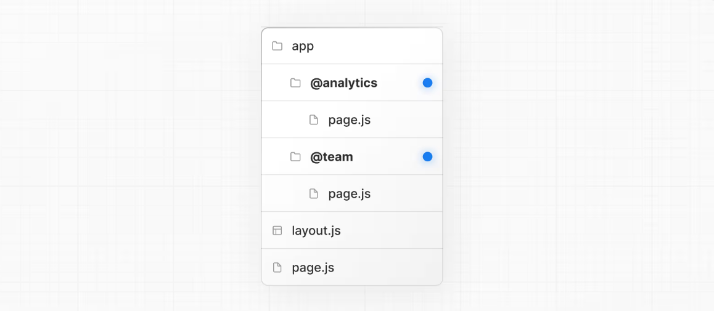

# Parallel Routes
```plainttext
- what they are?
```

- Parallel Routes allows you to simultaneously or conditionally render one or more pages within the same layout. They are useful for highly dynamic sections of an app, such as dashboards and feeds on social sites.

- For example, considering a dashboard, you can use parallel routes to simultaneously render the team and analytics pages:



## Convention
- Slots
Parallel routes are created using named slots. Slots are defined with the @folder convention. For example, the following file structure defines two slots: @analytics and @team:



- Slots are passed as props to the shared parent layout. For the example above, the component in app/layout.js now accepts the @analytics and @team slots props, and can render them in parallel alongside the children prop:

```tsx
export default function Layout({
  children,
  team,
  analytics,
}: {
  children: React.ReactNode
  analytics: React.ReactNode
  team: React.ReactNode
}) {
  return (
    <>
      {children}
      {team}
      {analytics}
    </>
  )
}
```

- However, slots are not route segments and do not affect the URL structure. For example, for /@analytics/views, the URL will be /views since @analytics is a slot. Slots are combined with the regular Page component to form the final page associated with the route segment. Because of this, you cannot have separate prerendered and dynamically rendered slots at the same route segment level. If one slot is dynamic, all slots at that level must be dynamic.

```plainText
Good to know:
The children prop is an implicit slot that does not need to be mapped to a folder. This means app/page.js is equivalent to app/@children/page.js.
```

---

**Parallel Routes** تسمح لك بعرض صفحة واحدة أو أكثر **في نفس الوقت** أو **بشكل شرطي** داخل نفس الـ **layout**.
وهي مفيدة للأقسام الديناميكية جداً في التطبيق، مثل **لوحات التحكم (dashboards)** و**صفحات المنشورات (feeds)** في مواقع التواصل الاجتماعي.

على سبيل المثال، عند التفكير في **dashboard**، يمكنك استخدام **parallel routes** لعرض صفحات **team** و**analytics** في نفس الوقت.

---

## **Parallel routes are created using named slots**

**يتم إنشاء الـ Parallel Routes باستخدام Slots مُسمّاة.**

الـ **Slots** يتم تعريفها باستخدام تسمية المجلد بالشكل:

```plaintext
@folder
```

مثال:

```plaintext
app/
  @analytics/
  @team/
```

هذا الـ structure يعرّف **slotين**:

* `@analytics`
* `@team`

---

## **Slots are passed as props to the shared parent layout**

**الـ Slots يتم تمريرها كـ props إلى الـ layout الأب المشترك.**

مثال:

```tsx
export default function Layout({
  children,
  team,
  analytics,
}: {
  children: React.ReactNode
  analytics: React.ReactNode
  team: React.ReactNode
})
```

المعنى:

> Next.js يمرّر محتوى كل slot إلى الـ layout كأنه prop.

---

## **and can render them in parallel alongside the children prop**

**ويمكن للـ layout عرضهم بالتوازي (parallel) بجانب `children`.**

```tsx
return (
  <>
    {children}
    {team}
    {analytics}
  </>
)
```

يعني:

```plaintext
children   | team   | analytics
```

كلهم ينrenderوا بنفس الوقت.

---

## **However, slots are not route segments and do not affect the URL structure**

**لكن الـ slots ليست route segments، ولا تؤثر على شكل الـ URL.**

مثال:

```plaintext
/@analytics/views
```

الـ URL الفعلي سيكون:

```plaintext
/views
```

لأن:

```plaintext
@analytics
```

هو **slot** وليس جزء من الـ route.

---

## **Slots are combined with the regular Page component to form the final page**

**الـ Slots يتم دمجها مع صفحة `page.tsx` العادية لتشكيل الصفحة النهائية.**

يعني:

```plaintext
page.tsx
+ slots
=
final page
```

---

## **Because of this, you cannot have separate prerendered and dynamically rendered slots at the same route segment level**

**لهذا السبب، لا يمكنك أن تجعل بعض الـ slots static (prerendered) وبعضها dynamic في نفس المستوى.**

يعني:

إذا كان عندك:

```plaintext
dashboard/
  @users
  @revenue
  @notifications
```

وكان:

```plaintext
@users → dynamic
```

فلازم:

```plaintext
@revenue → dynamic
@notifications → dynamic
```

كلهم نفس النوع.

---

## **If one slot is dynamic, all slots at that level must be dynamic**

**إذا كان slot واحد dynamic، فكل الـ slots في نفس المستوى يجب أن تكون dynamic.**

---

## **Good to know**

### **The children prop is an implicit slot**

**الـ `children` هو slot ضمني (implicit).**

يعني:

أنت لا تحتاج لعمل folder اسمه:

```plaintext
@children
```

---

## **This means app/page.js is equivalent to app/@children/page.js**

**هذا يعني أن:**

```plaintext
app/page.js
```

تعادل:

```plaintext
app/@children/page.js
```

لكن:

```plaintext
@children
```

يتم إنشاؤه تلقائياً بواسطة Next.js.

---

## خلاصة سريعة تحفظها 🔑

* `@folder` = **Slot**
* Slot يُمرّر كـ **prop** إلى layout
* Slot **ليس جزء من URL**
* `children` = **slot تلقائي**
* إذا slot واحد dynamic → كلهم dynamic

---
