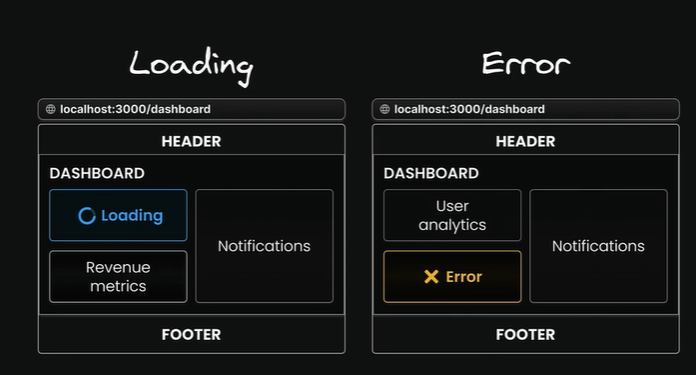

- What they are:

   - routing is an advanced routing mechanism that lets us render multiple pages simultaneously within the same layout

- Use Cases:
  - Dashboards with mutltiple sections
  - Split-view interfaces
  - Mutlti-pane layouts
  - Complex admin interaces

- Paralle routes benefits
  1. Parallel routes are great for splitting a layout into manageable slots
  (especially when different teams work on different parts)
  2. Independent route handling
      - Each slot in your layout, such as users, revenue, and notifications, can handle its
      own loading and error states
      - This granular control is particularly useful in scenarios where different sections of
      the page load at varying speeds or encounter unique errors

      

  3. Sub-navigation

- Note:
  - Slot are not route segment and don't affect your url structure.
  - children prop is actually an implicit slot, that doesn't need its own folder, complex-dashboard/page.tsx is the same as complex dashboard/@children/page.tsx
