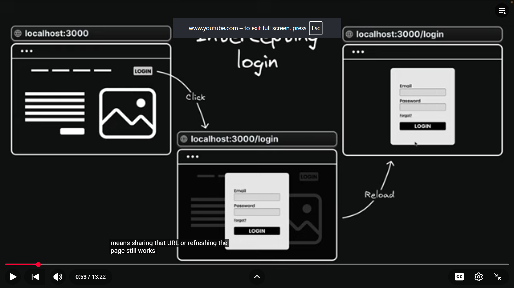
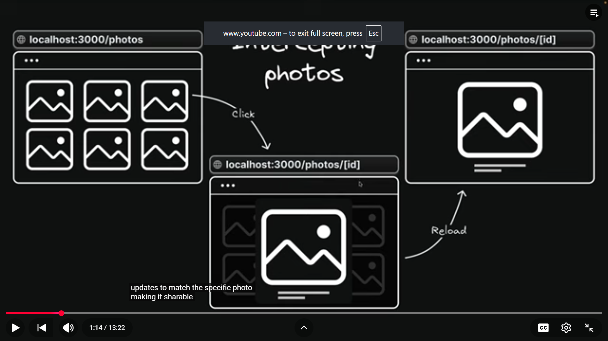

# Intercepting routes

Intercepting routes is an advanced routing mechanism that allows you to load a
route from another part of your application within the current layout.

It's particularly useful when you want to display new content while keeping your
user in the same context.

- Ex:
  

  

- Intercepting routes conventions

  - (.) to match segments on the same level
  - (..) to match segments one level above
  - (..)(..) to match segments two levels above
  - (...) to match segments from the root app directory

- tree:

```plainText
app
│
├── f1
│   ├── page.tsx          → F1 Page
|   |
|   |── f2
│   |    └── page.tsx 
|   |    |
|   |    |__ (..)(..)f4
|   |    |    |___page.tsx
│   │    |
|   |    |__ inner-f2
|   |        |__ page.tsx
|   |        |__ (...)f5
|   |             |__ page.tsx
│   ├── (.)f2
│   │   └── page.tsx      → (.) Intercepted F2 Page
│   │   |
|   |
│   └── (..)f3
│       └── page.tsx      → (..) Intercepted F3 Page
│
├    
│
└── f3
|    └── page.tsx  
|
|___ f4
|     |__ page.tsx   
|
|___ f5
     |__ page.tsx  
```
