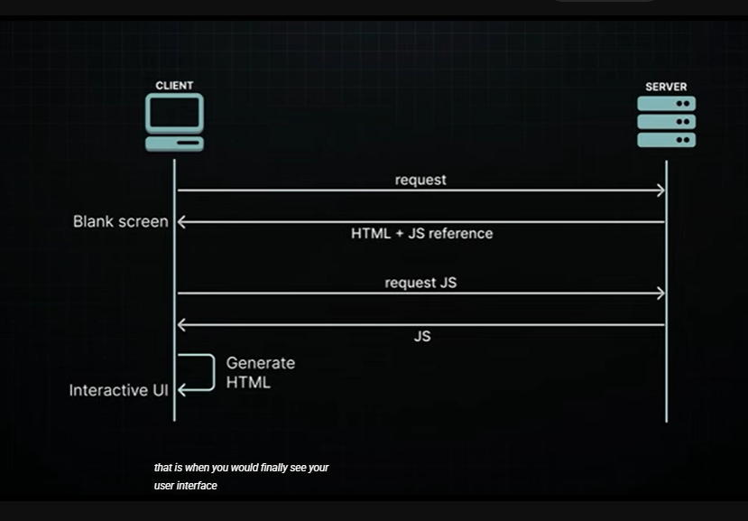
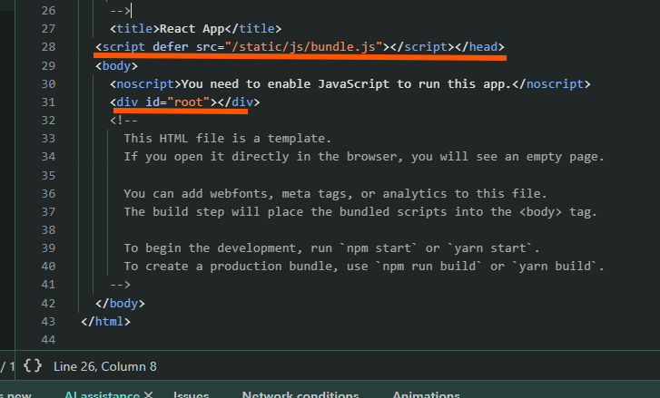
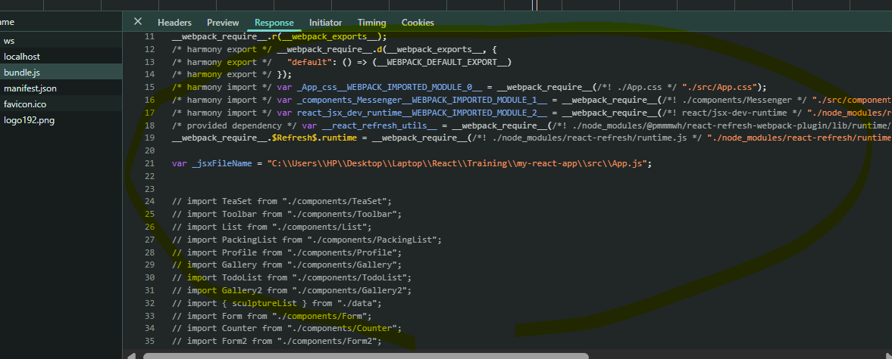
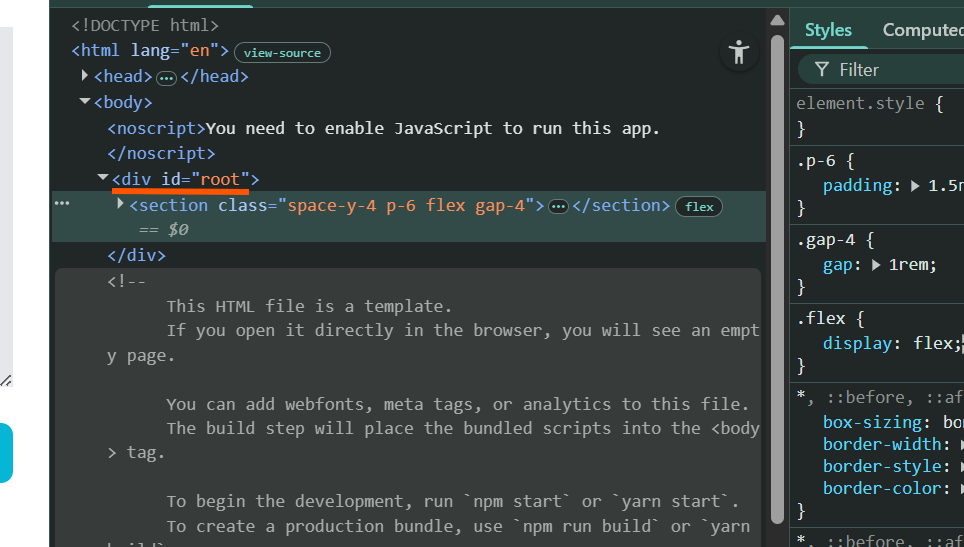

# Rendering in React

## Part 1:
We need to look at how React's rendering has evolved over the past decade

You probably remember when React was primarily used for building Single Page
Applications (SPAs)

- Explain:
  - when a client visited your website the server would send back a single html page, this page was pretty Bare Bones, just a simple div tag (empty) and a link or reference to a Javacsript (bundle.js)
  file.
  

  - the bundle.js is a real powerhouse wich contains everything (the react library, your application code),
  everything you needed to run your application 
  

  - the browser would download this file as soon as the html was processed.Once your browser downloaded all the js would get to work, genertating the HTML right there on your computer injecting it into the dom under that root div element
  

---
## Part 2:
This whole approach - where your browser (the client) transforms React
components into what you see on screen - that's what we call client-side rendering
(CSR)

CSR became super popular for SPAs, and everyone was using it

It wasn't long before developers began noticing some inherent drawbacks to this
approach

### Drawbacks of CSR

- <u>SEO</u>:
  When search engines crawl your site, they're mainly looking at HTML content. But
  with CSR, your initial HTML is basically just an empty div - not great for search
  engines trying to figure out what your page is about

  When you have a lot of nested components making API calls, the meaningful
  content might load too slowly for search engines to even catch it

- <u>Performance</u>:
  Your browser (the client) has to do everything: fetch data, build the UI, make
  everything interactive ... that's a lot of work!

  Users often end up staring at a blank screen or a loading spinner while all this
  happens

  Every time you add a new feature to your app, that JavaScript bundle gets bigger,
  making users wait even longer

  This is especially frustrating for people with slower internet connections