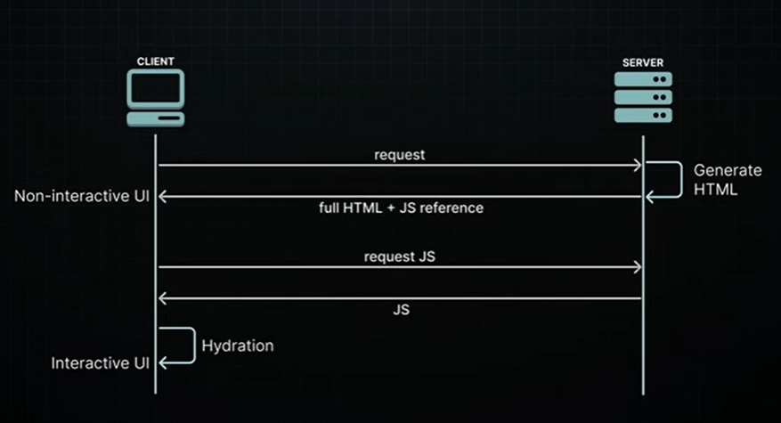

# Server-side solutions

Search engines can now easily index the server-rendered content, solving our
SEO problem

Users see actual HTML content right away instead of staring at a blank screen or
loading spinner



---

## Hydration

During hydration, React takes control in the browser and reconstructs the
component tree in memory, using the server-rendered HTML as a blueprint

It carefully maps out where all the interactive elements should go, then hooks up
the JavaScript logic

This involves initializing application state, adding click and mouseover handlers,
and setting up all the dynamic features needed for a full interactive user
experience

```عملية Hydration في React
مفهوم الترطيب (Hydration) في React

أثناء عملية Hydration، يتولى React زمام الأمور داخل المتصفح لإعادة بناء شجرة المكونات في الذاكرة، مستخدماً الـ HTML الجاهز من الخادم كمخطط أساسي.

كيف تتم العملية؟

  - رسم الخارطة: يحدد React أماكن العناصر التفاعلية بدقة.
  - الربط المنطقي: يتم ربط كود الـ JavaScript بالعناصر الموجودة (مثل أزرار النقر).
  - التفعيل: تهيئة حالة التطبيق (State) وتجهيز كافة الميزات الديناميكية.

باختصار: المتصفح لا يعيد توليد HTML جديد، بل يقوم "بإحياء" الهيكل الساكن الذي أرسله الخادم ليجعله تفاعلياً.
```

---

## Server-side solutions

1. Static Site Generation (SSG)
2. Server-Side Rendering (SSR)

- SSG happens during build time when you deploy your application to the server.
This results in pages that are already rendered and ready to serve. It's perfect for
content that stays relatively stable, like blog posts

- SSR, on the other hand, renders pages on-demand when users request them. It's
ideal for personalized content like social media feeds where the HTML changes
based on who's logged in.

Server-Side Rendering (SSR) was a significant improvement over Client-Side
Rendering (CSR), providing faster initial page loads and better SEO
vith its own

---

## Drawbacks of SSR

    1- You have to fetch everything before you can show anything

    Components cannot start rendering and then pause or "wait" while data is still
    being loaded

    If a component needs to fetch data from a database or another source (like an
    API), this fetching must be completed before the server can begin rendering the
    page

    This can delay the server's response time to the browser, as the server must finish
    collecting all necessary data before any part of the page can be sent to the client

    --------------------------------------------------------------------------

    2. You have to load everything before you can hydrate anything

    For successful hydration, where React adds interactivity to the server-rendered
    HTML, the component tree in the browser must exactly match the
    server-generated component tree

    This means that all the JavaScript for the components must be loaded on the
    client before you can start hydrating any of them

      ### **2. يجب تحميل كل شيء قبل البدء في "الترطيب" (Hydration)**

      لكي تنجح عملية الـ **Hydration** (وهي المرحلة التي يضيف فيها React التفاعلية إلى الـ HTML القادم من الخادم)، يجب أن تطابق شجرة المكونات في المتصفح تماماً شجرة المكونات التي تم إنشاؤها في الخادم.

      وهذا يعني أنه يجب تحميل **كافة ملفات الـ JavaScript** الخاصة بجميع المكونات الموجودة في الصفحة على جهاز العميل (المتصفح) قبل أن يتمكن React من البدء في عملية ترطيب أي جزء منها.


      ---

      ### **لماذا يُعد هذا مشكلة؟ (الشرح المبسط)**

      تخيل أن صفحتك تحتوي على:
      1.  **قائمة جانبيّة (Sidebar)** بسيطة جداً.
      2.  **خلاصة أخبار (News Feed)** معقدة جداً وتحتاج ملفات جافاسكريبت ضخمة.

      في النظام التقليدي، لن يستطيع المستخدم التفاعل مع "القائمة الجانبية" (حتى لو كانت ملفاتها صغيرة وجاهزة)، لأن React ينتظر تحميل جافاسكريبت "خلاصة الأخبار" الضخمة ليقوم بعمل **Hydration** للصفحة كاملة دفعة واحدة.

      ### **النقاط الرئيسية للفهم:**
      * **المطابقة التامة:** إذا اختلف الـ HTML الموجود في المتصفح عن الكود الذي يحاول React بناءه، سيحدث خطأ (Hydration Mismatch).
      * **الكل أو لا شيء:** عملية الترطيب التقليدية هي عملية "انفجارية" واحدة؛ إما أن تترطب الصفحة كاملة أو لا شيء، ولا يمكن ترطيب أجزاء معينة وترك الباقي لاحقاً (إلا باستخدام التقنيات الحديثة مثل *Selective Hydration*).

      **الخلاصة:** هذا القيد يجعل الموقع يبدو سريعاً (لأن الـ HTML ظهر)، ولكنه يظل "متجمداً" وغير مستجيب للنقرات لفترة طويلة إذا كانت ملفات الجافاسكريبت كبيرة.

      هل تريد أن ننتقل للنقطة الثالثة، أم نربط هذه النقاط بما يسمى "وادي الغرابة" (Uncanny Valley) في تجربة المستخدم؟
    ```

    --------------------------------------------------------------------------
    3. You have to hydrate everything before you can interact with anything

    React hydrates the component tree in a single pass, meaning once it starts
    hydrating, it won't stop until it's finished with the entire tree

    As a consequence, all components must be hydrated before you can interact with
    any of them.

## Drawbacks of SSR - all or nothing waterfall

1. We can't start rendering HTML until all data is fetched on the server
2. We need to wait for all JavaScript to load on the client before hydration can
begin
3. Every component needs to be hydrated before any of them become interactive

at once, create an "all or nothing" waterfall problem that spans from the server to
the client, where each issue must be resolved before moving to the next one

This becomes really inefficient when some parts of your app are slower than
others, as is often the case in real-world apps

