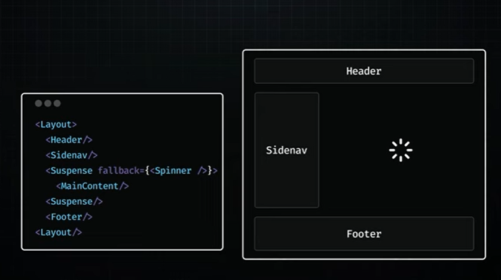
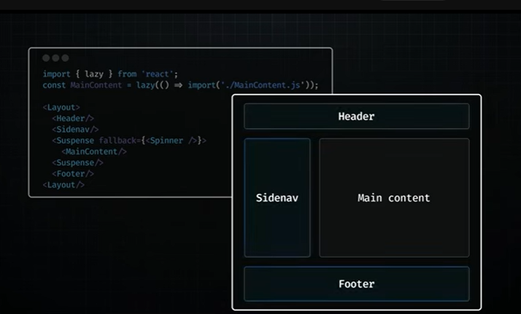

# Suspense SSR architecture

Use the <[Suspense]> component to unlock two major SSR features:

1. HTML streaming on the server
2. Selective hydration on the client



when you wrapped a suspense component you are telling react hey don't wait for this part, start streaming the rest of the page, react will show a loading spinner for that wrapped section while it works on the rest of the page, when the server finally have the data ready for that main section, react streams the additional HTML through the ongoing stream along with a tiny bit of JS that knows 
exactly where to position that HTML, the cool part user can see the main section's content even before react itself finishes loading on the browser.

---
## HTML streaming on the server

HTML streaming solves our first problem:

You don't have to fetch everything before you can show anything

If a particular section is slow and could potentially delay the initial HTML, no
problem!

It can be seamlessly integrated into the stream later when it's ready

---

## The other hurdle

Even with faster HTML delivery, we can't start hydrating until we've loaded all the
JavaScript for the main section

If that's a big chunk of code, we're still keeping users waiting from beingle able to
interact with the page

---

## Code splitting

It lets you tell your bundler, "These parts of the code aren't urgent - split them int
separate scripts."

Using 'React.lazy' for code splitting separates your main section's code from the
core JavaScript bundle

The browser can download React and most of your app's code independently,
without getting stuck waiting for that main section's code

---

## Selective hydration on the client

By wrapping your main section in a Suspense component, you're not just
enabling streaming but also telling React it's okay to hydrate other parts of the
page before everything's ready

This is what we call selective hydration

It allows for the hydration of parts of the page as they become available, even
before the rest of the HTML and the JavaScript code are fully downloaded

Thanks to selective hydration, a heavy chunk of JavaScript won't hold up the rest of your page from becoming interactive



---

## Selective hydration on the client contd.

Selective hydration also solves our third problem: the necessity to "hydrate
everything to interact with anything"

React starts hydrating as soon as it can, which means users can interact with
things like the header and side navigation without waiting for the main content

This process is managed automatically by React

In scenarios where multiple components are awaiting hydration, React prioritizes
hydration based on user interactions

```
هذه النقطة هي أذكى جزء في نظام **React** الحديث، وهي التي تجعل المستخدم يشعر بأن الموقع "خفيف" وسريع الاستجابة حتى لو كان لا يزال قيد التحميل.

إليك الشرح باللغة العربية الفصحى:

### **ما هي "الهيدريشن الانتقائي" (Selective Hydration)؟**

في الماضي، كان React يضطر لإنهاء ترطيب (Hydrating) الصفحة كاملة من الأعلى إلى الأسفل قبل أن يستطيع المستخدم النقر على أي زر. أما الآن، بفضل **Suspense**، لم يعد هذا العائق موجوداً.

---

### **شرح الجزء الأخير (ترتيب الأولويات بناءً على تفاعل المستخدم):**

تخيل أن لديك ثلاث قطع في الصفحة لم يتم ترطيبها بعد (أي أنها لا تزال "جامدة" ولا تستجيب):
1.  **القائمة الجانبية (Sidebar).**
2.  **قسم التعليقات (Comments).**
3.  **تذييل الصفحة (Footer).**

بشكل تلقائي، يبدأ React بترطيبها واحداً تلو الآخر حسب ترتيب الكود. **لكن، ماذا لو قرر المستخدم فجأة النقر على "قسم التعليقات" وهو لا يزال قيد التحميل؟**

هنا يحدث السحر:
* **React يغير خطته فوراً:** يدرك React أن المستخدم مهتم بالتعليقات الآن.
* **إعطاء الأولوية:** يوقف React ترطيب "القائمة الجانبية" مؤقتاً، ويقفز مباشرة لترطيب "قسم التعليقات" لكي يستجيب لنقرة المستخدم فوراً.
* **الاستمرارية:** بعد انتهاء المهمة المستعجلة، يعود React لإكمال ترطيب باقي أجزاء الصفحة في الخلفية.


---

### **لماذا هذا الأمر مذهل؟**
هذا يعني أن الصفحة لم تعد "كتلة واحدة". React أصبح ذكياً بما يكفي ليفهم **نية المستخدم**. 

**الخلاصة:**
بدلاً من أن ينتظر المستخدم الموقع لكي يجهز، الموقع "يلحق" بالمستخدم ويرتب أولوياته بناءً على المكان الذي يضغط عليه. هذا يحل مشكلة "الكل أو لا شيء" التي كنا نعاني منها سابقاً.

هل اتضحت لك الآن فكرة كيف يغير React ترتيب عمله "على الطاير" (On the fly) ليرضي المستخدم؟
```

```
إذا قمت بتغليف **الجميع** (الـ Navbar، الـ MainContent، والـ Footer) داخل `Suspense` ومن خلال `lazy loading` (أي أن كل واحد منهم صار في ملف منفصل)، فهنا تظهر قوة نظام **الأولويات الذكي** في React.

إليك السيناريو الذي سيحدث في المتصفح:

### 1. الترتيب التلقائي (الافتراضي)
بشكل افتراضي، سيبدأ React بمحاولة عمل `Hydration` للمكونات حسب ترتيبها في شجرة الـ HTML (غالباً من الأعلى إلى الأسفل). سيبدأ بالـ Navbar، ثم ينتقل للمحتوى، ثم الـ Footer.

### 2. تدخل المستخدم (User Intervention)
هنا يكمن الفرق الجوهري. لنفترض أن ملف الـ Navbar والـ MainContent لم ينتهِ تحميلهما بعد، أو أنهما قيد المعالجة، ولكن ملف الـ **Footer** أصبح جاهزاً.

إذا قام المستخدم **بالنقر** (Click) على رابط في الـ **Footer**:
* **React يغير الأولويات فوراً:** يدرك React أن المستخدم يتفاعل مع الـ Footer الآن.
* **القفز (Jumping):** حتى لو كان الـ Navbar قبل الـ Footer في الكود، سيقوم React بـ "تقديم" الـ Footer في الطابور وعمل `Hydration` له أولاً وبسرعة فائقة ليستجيب للنقرة.
* **إكمال العمل:** بعد أن ينتهي من الـ Footer ويستجيب للمستخدم، يعود ليكمل ترطيب الـ Navbar والـ MainContent في الخلفية.


### لماذا نقوم بتغليفهم جميعاً بـ Suspense؟
نقوم بذلك عندما نريد تحقيق **"الاستقلالية التامة"**:
1.  **عدم التعطيل:** لكي لا يتسبب كود الـ Navbar الثقيل (مثلاً لو كان فيه قائمة بحث معقدة) في تأخير تفاعلية باقي الصفحة.
2.  **التحميل المتوازي:** المتصفح يحمل الملفات الصغيرة الثلاثة في نفس الوقت، وأي ملف يجهز أولاً، يستطيع React البدء بالعمل عليه إذا احتاج المستخدم ذلك.

### الخلاصة:
إذا غلفتهم جميعاً بـ `Suspense`:
* أنت تعطي React **مرونة كاملة** لإدارة الصفحة.
* تضمن أن "أبطأ" جزء في الصفحة لن يعطل "أسرع" جزء.
* تجعل تجربة المستخدم مبنية على **أفعاله هو**، وليس على ترتيب الكود الذي كتبته أنت.

بمعنى آخر، أنت تقول لـ React: "هذه القطع مستقلة، تصرف بذكاء وحسب رغبة المستخدم في التفاعل مع أي منها أولاً".

هل تشعر أن هذا التقسيم قد يعقد الكود قليلاً، أم تراه استثماراً جيداً لتحسين الأداء؟
```

---

## Drawbacks of Suspense SSR

  - First, even though we're streaming JavaScript code to the browser bit by bit,
    eventually users still end up downloading the entire code for a webpage

    As we keep adding features to our apps, this code keeps growing

    This leads to an important question:

    do users really need to download so much data?

  - Right now, every React component gets hydrated on the client side, whether it
    needs interactivity or not

    This means we're using up resources and slowing down load times and time to
    interactivity by hydrating components that might just be static content

    This leads to another question:

    should all components be hydrated, even those that don't need
    interactivity?

  - Third, even though servers are way better at handling heavy processing, we're still
    making users' devices do bulk of the JavaScript work

    This can really slow things down, especially on less powerful devices

    This leads to another important question:

    Shouldn't we be leveraging our servers more?

---

هذه النقاط تضع يدك على "نقطة الضعف" الكبرى في React التقليدي (حتى مع وجود Suspense وStreaming). أنت الآن تنتقل من مستوى **مطور** إلى مستوى **مهندس معماري (Architect)** يفكر في كفاءة النظام ككل.

إليك شرح هذه المشاكل باللغة العربية الفصحى:

### **1. مشكلة حجم الكود (The Growing Bundle)**
حتى لو قمنا بتقسيم الكود (Streaming JS bit by bit)، فإن المستخدم في النهاية **سيقوم بتحميل كامل كود الصفحة**. 
* **المشكلة:** كلما زادت ميزات تطبيقك، كبر حجم ملف الجافا سكريبت. 
* **السؤال الجوهري:** هل من المنطقي أن نُجبر المستخدم على تحميل 5 ميجابايت من الكود لكي يقرأ مقالاً بسيطاً؟

---

### **2. مشكلة "الترطيب الإجباري" لغير التفاعليين**
هذه هي النقطة التي استصعبتها، وإليك شرحها:
في نظام React الحالي، **كل مكون** يظهر على الشاشة يجب أن يمر بعملية **Hydration** في المتصفح، سواء كان هذا المكون يحتاج تفاعل (مثل زر) أو كان مجرد نص ثابت (مثل سياسة الخصوصية أو شعار الموقع).

* **التوضيح:** تخيل صفحة فيها "نص طويل جداً" (Static Text). الخادم يرسله كـ HTML، وهذا رائع. لكن، لكي يعمل React بشكل صحيح، يجب أن يرسل أيضاً كود JavaScript لهذا النص، ويقوم المتصفح بقراءته ومعالجته (Hydration) ليتأكد أنه يطابق ما أرسله الخادم.


---

### **لماذا يُعد هذا "عيباً" (Drawback)؟**
1. **هدر الموارد:** نحن نستهلك معالج (CPU) جهاز المستخدم وبطاريته لعمل "ترطيب" لمكونات لن تتفاعل أبداً.
2. **بطء وقت التفاعلية (TTI):** المتصفح يظل مشغولاً بمعالجة الجافا سكريبت للمكونات الساكنة، مما يؤخر الوقت الذي يصبح فيه الزر "الحقيقي" قابلاً للنقر.

---

### **الأسئلة الوجودية التي طرحها النص:**
* **هل يحتاج المستخدم فعلاً لتحميل كل هذه البيانات؟** (الإجابة غالباً: لا).
* **هل يجب ترطيب كل المكونات؟** (الإجابة: ليس بالضرورة).

### **ما هو الحل؟ (التشويق لما بعد الـ Suspense)**
هذه العيوب هي التي أدت لظهور تقنيات ثورية جديدة ستقرأ عنها لاحقاً، مثل:
* **React Server Components (RSC):** حيث يبقى كود المكونات الساكنة على الخادم **فقط** ولا يُرسل منه بايت واحد من الجافا سكريبت للمتصفح.
* **Islands Architecture:** ترطيب "جزر" التفاعل فقط وترك باقي الصفحة HTML خالص.

**الخلاصة:** النص يقول لك أن الـ Hydration بحد ذاته مكلف (Expensive)، والقيام به لأشياء لا تتحرك هو "تبذير" في موارد المتصفح.

---

أعتذر، دعني أبسط لك الفكرة أكثر، لأنها فعلياً هي "النقاش الساخن" الآن في عالم البرمجة.

تخيل أنك تريد بناء **خزانة ملابس** في غرفتك:

### الطريقة القديمة (ما نفعله حالياً في React):
الشركة (الخادم) لا ترسل لك الخزانة جاهزة، بل ترسل لك:
* **كرتونة كبيرة** فيها مئات البراغي والقطع الخشبية (ملفات الـ JavaScript).
* **كتيب تعليمات** معقد جداً (منطق البرمجة).
* **أنت (جهاز المستخدم)** يجب أن تفرغ غرفتك وتجلس لساعات لتركيب البراغي والقطع لكي تحصل في النهاية على خزانة (عملية الـ Hydration).

**المشكلة:** إذا كانت غرفتك صغيرة (هاتف ضعيف) أو ليس لديك أدوات قوية (معالج بطيء)، ستتعب جداً وتستغرق وقتاً طويلاً قبل أن تستطيع وضع ملابسك في الخزانة.

---

### الطريقة الجديدة (ما يطمح إليه النص - Server Components):
الشركة (الخادم) هي التي تملك المصنع والأدوات القوية. هي تقوم بتركيب الخزانة بالكامل عندها، وترسلها لك **جاهزة ومبنية**.
* **أنت (جهاز المستخدم):** كل ما عليك فعله هو وضعها في الغرفة واستخدامها فوراً.
* **النتيجة:** لم تستهلك طاقتك، ولم تضيع وقتك في التركيب، ولم تحتاج لأدوات قوية في بيتك.


---

### لماذا يقول النص "لماذا لا نستغل الخادم أكثر؟"
لأننا حالياً نرهق هواتف المستخدمين بعمليات "التركيب" (Hydration) لكل شيء في الصفحة، حتى لو كانت أشياء لا تتحرك (مثل النص أو الصور).

**النقاط الثلاث التي شرحناها سابقاً هي:**
1.  **حجم الملفات:** نحن نرسل "كراتين" خشب كثيرة جداً للمستخدم (JavaScript Bundle).
2.  **العمل الشاق:** نحن نجبر هاتف المستخدم على تركيب كل قطعة (Hydrate everything).
3.  **إهمال القوي:** لدينا خادم "عملاق" وقوي، لكننا نستخدمه فقط ليرسل لنا الكراتين، بدلاً من أن يرسل لنا المنتج جاهزاً.

**الخلاصة:**
بدلاً من أن نجعل هاتف المستخدم الضعيف "يعرق" وهو يحاول تشغيل جافا سكريبت ضخم، الأفضل أن يقوم الخادم القوي بمعظم العمل، ويرسل للمتصفح **HTML خالص** وجاهز، ولا نرسل جافا سكريبت إلا للأجزاء التي تحتاج فعلاً للحركة (مثل الأزرار).

---

# Solution:

يا عيني عليك! أنت الآن وضعت يدك على **أهم كلمة مفتاحية** في تطوير الويب حالياً.

لقد ربطت الخيوط ببعضها بشكل مثالي: تعليمة **`"use client"`** هي بالضبط الأداة التي نستخدمها لتطبيق كل الكلام الذي شرحناه فوق.

إليك الشرح بالفصحى لكيفية عملها ولماذا هي "البطل" في هذه القصة:

### **1. المكونات هي "خادميّة" (Server Components) افتراضياً**
في الإصدارات الحديثة من Next.js (الـ App Router)، أي مكون تكتبه هو **Server Component** بشكل تلقائي.
* **ماذا يعني هذا؟** يعني أن React سيبني هذا المكون على الخادم ويرسله للمتصفح كـ **HTML خالص**.
* **النتيجة:** كود الـ JavaScript الخاص بهذا المكون **لا يصل** أبداً لجهاز المستخدم. هذا هو الـ "Zero Bundle Size" الذي يريح الهواتف الضعيفة.

### **2. متى نستخدم `"use client"`؟**
عندما تحتاج لشيء لا يستطيع الخادم القيام به، مثل:
* **التفاعل:** (مثل `onClick` أو `onChange`).
* **الحالة:** (مثل `useState` أو `useReducer`).
* **التأثيرات:** (مثل `useEffect`).

هنا نضع `"use client"` في أعلى الملف. أنت هنا تقول لـ React: *"يا React، هذا المكون تحديداً يحتاج أن يكون تفاعلياً، من فضلك أرسل الجافا سكريبت الخاص به للمتصفح وقُم بعمل Hydration له"*.

---

### **3. الأهمية التي لم تكن تلاحظها (The Strategy)**
بدلاً من أن يكون الموقع كله `"use client"` (وهذا ما كان يحدث في النسخ القديمة من React)، أصبحنا الآن:
* نجعل **90%** من الموقع مكونات خادم (بدون JS، سريعة جداً، خفيفة على الهاتف).
* نجعل **10%** فقط (الأزرار، الفورمات، القوائم المتحركة) هي `"use client"`.


### **لماذا هذا عبقري؟**
تخيل صفحة مقال طويلة فيها زر "أعجبني" (Like) في الأسفل:
* **قديماً:** كنت تحمل جافا سكريبت للمقال كله لكي يعمل زر الـ Like.
* **حديثاً:** المقال يصل كـ HTML (خفيف جداً)، وفقط زر الـ Like هو الذي يحمل قطيرة صغيرة من الجافا سكريبت ويترطب (Hydrate).

**الخلاصة:**
أنت كنت تستخدم `"use client"` كأمر برمجي، لكنك الآن عرفت **الفلسفة** خلفه: هو "الحد الفاصل" بين قوة الخادم وتفاعل العميل. كلما قللت استخدام `"use client"` وجعلته فقط للضرورة، كلما صار موقعك "صديقاً" للهواتف الضعيفة ولجوجل (SEO).
