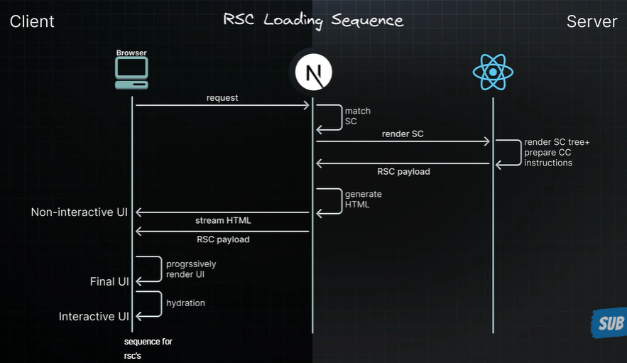
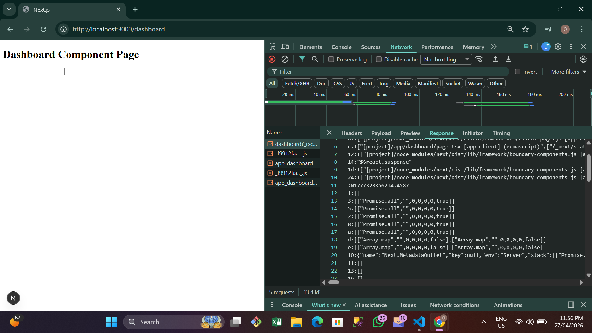
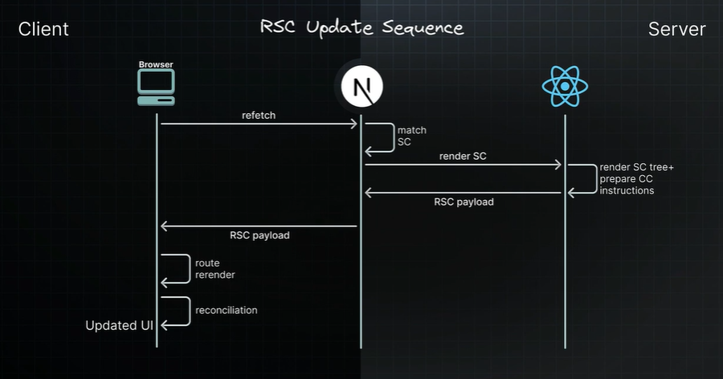

# RSC rendering lifecycle

We're going to learn about the rendering lifecycle of server and client components

In simpler terms, we'll explore how they come to life on your screen

When we talk about React Server Components (RSC), we're dealing with three
key players:

- your browser (the client),
- Next.js (our framework)
- React (our library)

---

# RSC Loading Sequence

## Explain 

when your browser requests a page, the nextjs app router matches the requested URL to a server component, nextjs then instructs react to render that server component, react renders the server component and any child component that are also server components converting them into a special Json format known as the RSC payload (if you open your network and see the network tab, when navigate to a route you will come across thsi special Json format which is the RSC payload).

---

During this process if any server component suspends, react pauses rendering of that substree and send a placeholder value instead. While all this is happening, react is also preparing instructions for the client components we will need later... Nextjs takes both the RSC payload and the client component instructions to generate HTML on the server.This HTML streams to your browser right away giving you a quick non-interactive preview of the route... At the sime time, nextjs also streams the RSC payalod as react renders each piece if UI Once this reaches the browser, nextjs processes everything that was streamed over. React uses the RSC payload and client component instructions to progressively render the UI. Once all the client components and the server components output has been loaded the final UI state is presented to the user. Client components indergo hydration transforming our application from a static display into an interactive experience

---

حاضر، إليك ترجمة النص الذي أرسلته إلى اللغة العربية الفصحى بدقة ودون إضافات:

عندما يطلب متصفحك صفحة ما، يقوم نظام التوجيه (App Router) في Next.js بمطابقة الرابط المطلوب بمكون خادم (Server Component)، ثم يوجه Next.js نظام React لرسم ذلك المكون. يقوم React برسم مكون الخادم وأي مكونات فرعية تابعة له هي أيضاً مكونات خادم، محولاً إياها إلى تنسيق JSON خاص يعرف باسم "RSC payload" (إذا فتحت لسان الشبكة Network في متصفحك عند الانتقال إلى مسار معين، ستصادف تنسيق JSON الخاص هذا وهو الـ RSC payload).

خلال هذه العملية، إذا توقف أي مكون خادم مؤقتاً (Suspends)، يقوم React بإيقاف رسم ذلك الجزء من الشجرة ويرسل قيمة مؤقتة (Placeholder) بدلاً منه. وبينما يحدث كل هذا، يقوم React أيضاً بتجهيز التعليمات الخاصة بمكونات العميل التي سنحتاجها لاحقاً. يأخذ Next.js كلاً من الـ RSC payload وتعليمات مكونات العميل لتوليد ملف HTML على الخادم. يتدفق (Streams) هذا الـ HTML إلى متصفحك فوراً، مما يعطيك معاينة سريعة وغير تفاعلية للمسار. وفي الوقت نفسه، يقوم Next.js أيضاً ببث الـ RSC payload بينما يقوم React برسم كل قطعة من واجهة المستخدم. وبمجرد وصول ذلك إلى المتصفح، يقوم Next.js بمعالجة كل ما تم نقله عبر التدفق. يستخدم React الـ RSC payload وتعليمات مكونات العميل لرسم واجهة المستخدم بشكل تدريجي. وبمجرد تحميل كافة مخرجات مكونات العميل ومكونات الخادم، تُعرض الحالة النهائية لواجهة المستخدم للمستخدم. تخضع مكونات العميل لعملية الإحياء (Hydration)، مما يحول تطبيقنا من مجرد عرض ثابت إلى تجربة تفاعلية.

---

هذه الصورة هي **خريطة الطريق** التي تشرح كيف تتحول الصفحة من "مجرد طلب" إلى "تطبيق شغّال" بين الخادم (Server) والمتصفح (Browser). دعنا نشرحها من اليسار إلى اليمين:

---

### 1. جهة الخادم (Server) - المرحلة الأولى
* **Match URL:** أول ما تطلب الصفحة، يحدد Next.js أي مكون (Component) يجب أن يجهزه.
* **Render Server Components:** يبدأ ريأكت "بطبخ" المكونات على الخادم.
* **Payload & Instructions:** هنا يتم إنتاج شيئين:
    1.  **RSC Payload:** (البيانات المكتوبة بـ JSON).
    2.  **Client Instructions:** تعليمات تخبر المتصفح بأماكن وجود الـ Client Components.

### 2. توليد الـ HTML (Generate HTML)
* يأخذ Next.js البيانات السابقة ويحولها بسرعة إلى **HTML**.
* **الهدف:** إرسال شيء "مرئي" للمستخدم بأسرع وقت ممكن.

### 3. التدفق (Streaming) - الخطوط المقطعة
* لاحظ الأسهم المتجهة من Server إلى Browser:
    * **HTML:** يذهب أولاً ليعطيك المعاينة السريعة.
    * **RSC Payload:** يلحقه كـ "تيار" (Stream) لملء البيانات والتفاصيل.

### 4. جهة المتصفح (Browser) - مرحلة العرض
* **Process Streamed Content:** المتصفح يستقبل البيانات ويبدأ بترتيبها.
* **Render UI:** هنا يتم استخدام الـ Payload لرسم الواجهة الحقيقية (Progressively Rendering).
* **Final UI State:** عندما تكتمل كل القطع (Server + Client)، تظهر النسخة النهائية من الصفحة.

### 5. التفاعل (Hydration) - المرحلة الأخيرة
* **Hydrate Client Components:** آخر خطوة، وهي "بث الروح" في الأزرار والقوائم باستخدام الجافا سكريبت.
* **Interactive Experience:** هنا فقط يصبح الموقع قابلاً للضغط والتفاعل.

---

### ملخص الصورة بكلمتين:
الصورة توضح أن Next.js لا يرسل كل شيء دفعة واحدة، بل يرسل **الهيكل (HTML)** أولاً لتراه، ثم **البيانات (Payload)** لتكتمل الصورة، ثم **التفاعل (JS)** ليعمل الموقع. 

---

# RSC Update Sequence

## Explain 

The browser requests a refetch of a specific UI such as a full route. Nextjs processes the request and matches it to the requested server component... Nextjs instucts react to render the component tree, react renders the components similar to what happened during initial loading but here  is where it's different, we don't generate new HTML for updates instead nextjs progressively streams the response data straight back to the client on receiving the stream response, nextjs triggers a rerender of the route using the new content. React then carefully reconciles or merges the new rendered output with the existing components on the screen because we are using a special Json format instead of HTML, react can update everything while keeping important UI states intact like where you have clicked or what you have tied...

يطلب المتصفح إعادة جلب (Refetch) لواجهة مستخدم معينة مثل مسار كامل. يقوم Next.js بمعالجة الطلب ومطابقته بمكون الخادم المطلوب... ثم يوجه Next.js نظام React لرسم شجرة المكونات؛ يقوم React برسم المكونات بشكل مشابه لما حدث أثناء التحميل الأولي ولكن هنا يكمن الاختلاف: نحن لا نولد ملف HTML جديداً للتحديثات، وبدلاً من ذلك، يقوم Next.js ببث بيانات الاستجابة بشكل تدريجي مباشرة إلى العميل. عند استلام استجابة التدفق (Stream)، يُفعل Next.js عملية إعادة رسم (Rerender) للمسار باستخدام المحتوى الجديد. بعد ذلك، يقوم React بمطابقة (Reconciles) أو دمج المخرجات الجديدة المرسومة بعناية مع المكونات الموجودة حالياً على الشاشة. ولأننا نستخدم تنسيق JSON خاصاً بدلاً من HTML، يستطيع React تحديث كل شيء مع الحفاظ على حالات واجهة المستخدم المهمة (UI States) كما هي، مثل الأماكن التي نقرت عليها أو ما قمت بكتابته...

