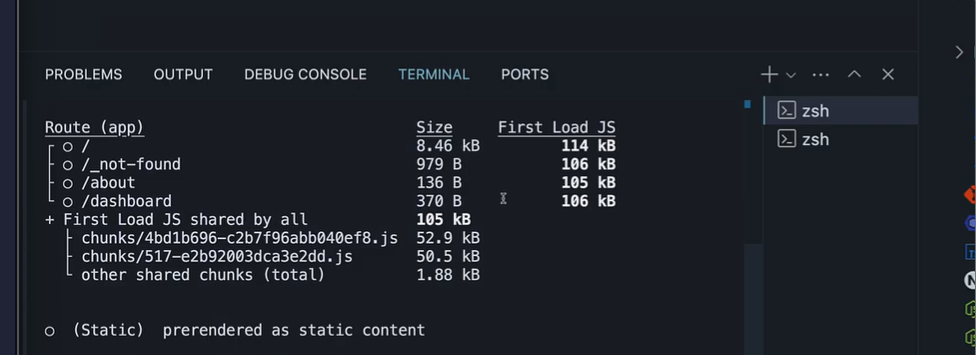
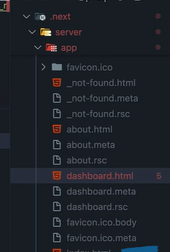
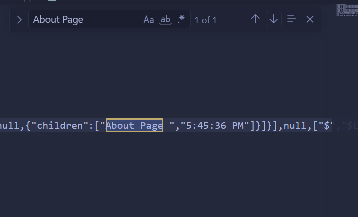
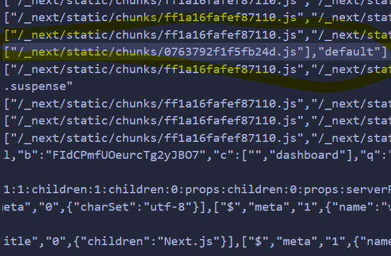
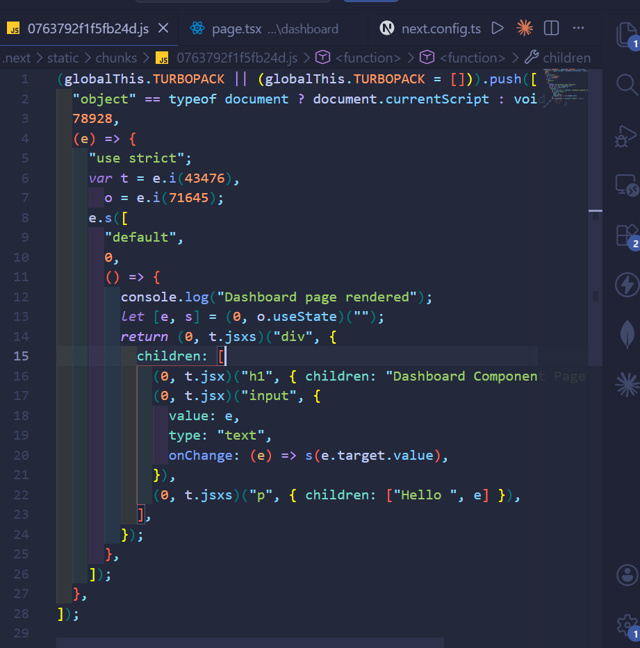
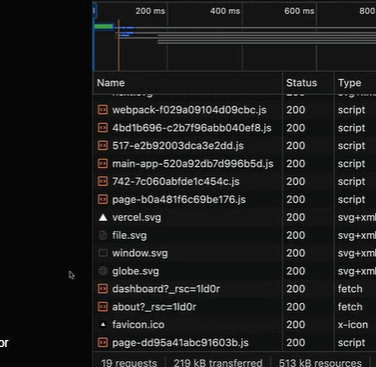
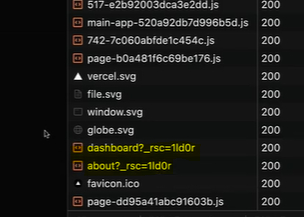

# Static rendering

Static rendering is a server rendering strategy where we generate HTML pages
when building our application

Think of it as preparing all your content in advance - before any user visits yourV
site

Once built, these pages can be cached by CDNs and served instantly to users

With this approach, the same pre-rendered page can be shared among different
users, giving your app a significant performance boost

Static rendering perfect for things like blog posts, e-commerce product listings,
documentation, and marketing pages

---

## How to statically render?

Static rendering is the default strategy in the app router

All routes are automatically prepared at build time without any additional setup

"Hold on - you keep talking about generating HTML at build time, but we haven't
built our application yet, right? We're just running it in development mode?"

---

## Production server vs dev server

In production, we create one optimized build and deploy it - no on-the-fly changes
after deployment

A development server, on the other hand
, focuses on the developer experience

We need to see our changes immediately in the browser without rebuilding the
app every time

In production, pages are pre-rendered once during the build

In development, pages are pre-rendered on every request

---
## Production Mode

- Size: shows how much data needs to downloaded when navigating to the corresponding page client side in the browser
- First Load Js: tells us how much gets downloaded when initially loading the page from the server 
- Whole circle (o): indicate that these routes are static.

- Explore Folders:
  
  - you might wonder why we see HTML for client components, that because even client components are pre-rendered as an optimization step.
  - HTML files are in the whole story, each routes also gets what id called an RSC payload, for example about.rsc for the about server component... these files with a special json format are generated by react for each route and represent your virtual DOM in a super compact way using abreviations and internal references for Server Components, this payload the actual rendered like the H1 tag with about page text in it.
  
  Client Components work a bit differently, their payload has placeholders showing where the client components should go plus references to their JS Files.
  Our dashboard payload for example points to where its component code lives.
  
   
  This stuff needed for reconciliation and hydration

- Explore browser
  - 
  - 
  -  These are essential for building the UI on the client side when navigate to /about or /dashboard using the links...
    - 
    There is also the dashboard component code page that has been downloaded 

- An important Question:
  - How did nextjs know to send us the about and dashboard stuff before clicked anything... That is thanks to a feature called prefetching...
  - Prefething:
    Prefetching is a technique that preloads routes in the background as their links
    become visible

    For static routes like ours, Next.js automatically prefetches and caches the whole
    route

    When our home page loads, Next.js is already prefetching about and dashboard
    routes for instant navigation

## Static rendering summary

Static rendering is a strategy where the HTML is generated at build time

Along with the HTML, RSC payloads for components and JavaScript chunks for
client-side hydration are created

Direct route visits serve HTML files

Client-side navigation uses RSC payloads and JavaScript chunks without
additional server requests

Static rendering is great for performance, especially in blogs, documentation, and
marketing pages
