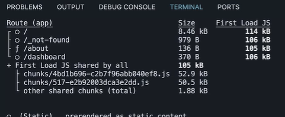
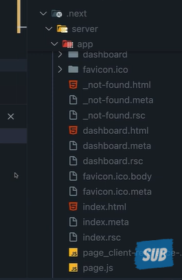

# Dynamic rendering

Dynamic rendering is a server rendering strategy where routes are rendered
uniquely for each user when they make a request

It is useful when you need to show personalized data or information that's only
available at request time (and not ahead of time during prerendering) - things like
cookies or URL search parameters

News websites, personalized shopping pages, and social media feeds are some
examples where dynamic rendering is beneficial

---

## How to dynamically render

Next.js automatically switches to dynamic rendering for an entire route when it
detects what we call a "dynamic function" or "dynamic API"

In Next.js, these dynamic functions are:

cookies()
- headers()
- connection()
- draftMode()
- searchParams prop
- after()

Using any of these automatically opts your entire route into dynamic rendering at
request time.

---

## Terminal

- Look at the about page it has a symbol (F)
- That means it become a dynamic route

---

## Folder

- we can't see the about.html 
- Reason:
  - Static Rendering: Next.js generates a full HTML file and a .rsc file (which contains the React Server Component payload) and stores them in this folder during the build process.

  - Dynamic Rendering: The page requires information that is only available at request time, such as data from a database or cookies. Consequently, there is no pre-built HTML file in the folder; instead, the code in page.js is executed on the server for every user request to generate the HTML "on the fly".

---

## Dynamic rendering summary

Dynamic rendering is a strategy where the HTML is generated at request time

Next.js automatically enables it when it encounters dynamic functions like cookies,
headers, connection, draftMode, after or searchParams prop

Dynamic rendering is great for personalized content like social media feeds

You don't have to stress about choosing between static and dynamic rendering

Next.js automatically selects the optimal rendering strategy for each route based
on the features and APIs you're using

if you want to force a route to be dynamically rendered, you can use the `export
const dynamic = 'force-dynamic" config at the top of your page
const Dynamic is equal to force Dynamic