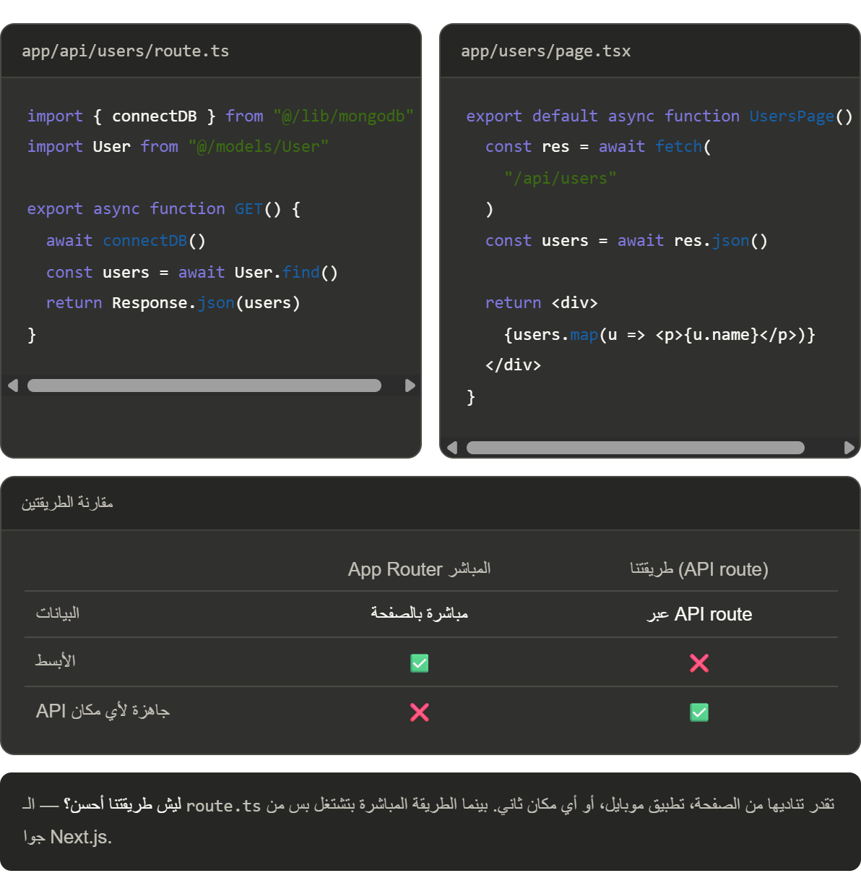

# How would you implement server-side data fetching from MongoDB in Next.js?

In Next.js, you can fetch data from MongoDB server-side using:

Pages Router — Use getServerSideProps for SSR or getStaticProps for SSG
App Router (Next.js 13+) — Use Server Components and directly query MongoDB in the component


Note: You must serialize MongoDB ObjectIds and dates properly when passing data as props.
```tsx
const users = await User.find()

// ❌ غلط — ObjectId مش string
props: { users }

// ✅ صح — حوّلهم لـ string
props: { users: JSON.parse(JSON.stringify(users)) }
```
---



