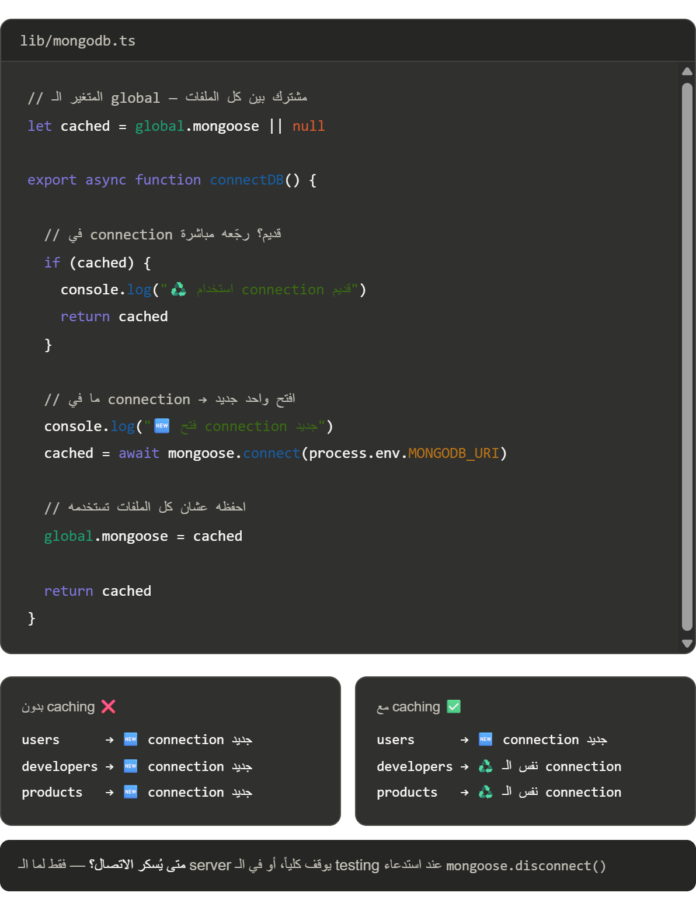

```tsx
import mongoose from "mongoose";

const MONGODB_URI = process.env.MONGODB_URI;

export default async function connectMongo() {
  if (!MONGODB_URI) {
    throw new Error("Missing MONGODB_URI in environment variables");
  }

  return mongoose.connect(MONGODB_URI as string, {
    bufferCommands: false
  });
}

```

- bufferCommands: false: A technical option that disables command buffering when the database connection is not ready. Instead of queuing operations, requests fail immediately—making it better suited for serverless environments in Next.js.

- How do you handle MongoDB connections in Next.js API routes to avoid connection pooling issues?

To avoid connection pooling issues, you should create a cached connection that reuses the same MongoDB client instance across multiple API route invocations. This is typically done by storing the connection promise in a global variable that persists between requests. This prevents creating a new connection on every API request.

- 

- **There is a problem in the previous code** — the `cached` variable only checks if the object exists, not if the connection is actually alive.
**To solve that, we check the connection's `readyState` before reusing it.**

Example:
```tsx
  if (cached && mongoose.connection.readyState === 1) {
    return cached  // ✅ شغال → استخدمه
  }
```

- **Always `await` when storing the connection in `cached` — otherwise it stores a Promise, not the actual connection.**

```ts
cached = await mongoose.connect(uri) // ✅ stores real connection
cached = mongoose.connect(uri)       // ❌ stores Promise
```

- Final Code
```tsx
import mongoose from "mongoose";

const MONGODB_URI = process.env.MONGODB_URI;

declare global {
  var mongooseCache: typeof import("mongoose") | null
}

let cached = global.mongooseCache || null;

export default async function connectMongo() {
  if (!MONGODB_URI) {
    throw new Error("Missing MONGODB_URI in environment variables");
  }

  if (cached && mongoose.connection.readyState === 1) return cached;

  cached = await mongoose.connect(MONGODB_URI as string, {
    bufferCommands: false
  });
  global.mongooseCache = cached;

  return cached;
}

```